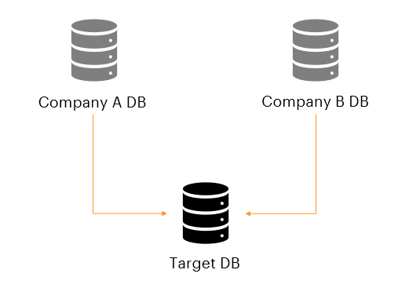
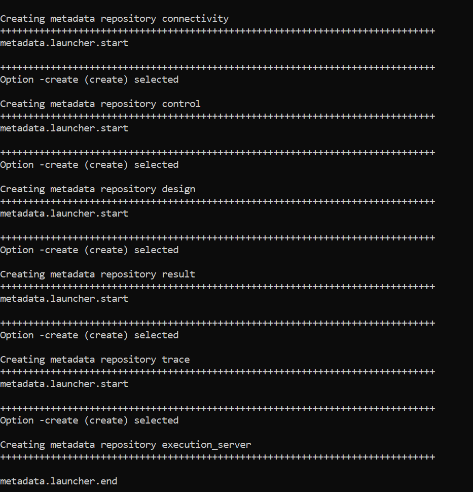
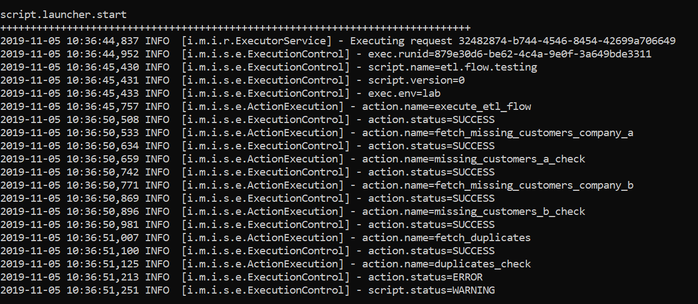

# USE CASE: Testing ETL flow of a merger

## Introduction

This demo displays a use case of the IESI framework. In this demo we'll test the automation of an ETL flow.

There are two companies: Company A and Company B which are merging. 
Both companies have a separate database: Company A DB and Company B DB. After the merger they want a single database, Target DB, which contains the customers of both companies
This is illustrated in the figure below. The new database shouldn't contain any duplicates. 
These duplicates are customers who were a customer of both company A and company B before the merger. 

## Getting Started

In this demo we are going to mimic the merger and test if the merging of the databases works.

The directory demo3 contains the following documents:
* etl: map which contains the code which is used to mimic the merger
* fwk: the documents needed to test the merging with the IESI framework
* company_a.db3: database of company A
* company_b.db3: database of company B
* etl.cmd: executable used to run etl-0.1.0-jar-with-dependencies
* etl-0.1.0-jar-with-dependencies: jar file of the etl source code
* target.db3

As can be seen the fwk map contains the files which are used in the easi framework. The files can be split into 3 components:
1. connections: used to set up the necessary connections
2. environment: to describe which environment we are using
3. scripts: the scripts that will be executed.

To get started we have to download and unpack IESI first. The download instructions can be found [here.](https://metadew.github.io/iesi/pages/download.html) 

## Starting the demo

To start the demo we'll first have to copy the demo3 directory to the iesi framework which we have downloaded in previous part.
We'll store it in the directory data, so we have: data/demo3.

### Configurations

We first have to make sure that the configurations are right. In conf/iesi-repository.conf we need the following configurations:

1. under: # Metadata Repository

* iesi.metadata.repository.name=demo_repository
* iesi.metadata.repository.type=sqlite
* iesi.metadata.repository.category=general

2. under: # SQLITE

* iesi.metadata.repository.sqlite.file=#iesi.home#/data/demo3/target.db3

* \#iesi.home# refers to the home directory of iesi

After the changes save the file. The rest can be left blank.

Next, the configuration repository will need to be created. Open a command window or shell: 

* navigate to the <code>bin</code> folder
* execute the following command 

for linux:

> bin/iesi-metadata.sh -create -type general

for windows:
> bin/iesi-metadata.cmd -create -type general

The screen shows the following output:

Look [here](https://metadew.github.io/iesi/pages/operate/operate.html) for more info about the command.

### Environment

Next we have to set up the environment which we are working in. 
The environment which will be used can be found in <code>data/demo3/fwk/metadata/environments/environment.yml</code> which contains
the following configuration:
>
>      ---
>      type: environment  
>      data:
>           name: "lab"  
>           description: "Lab environment"

Next, we will load the lab environment configuration file into the configuration repository:

* Copy the configuration file to the <code>metadata/in/new folder</code>
* Navigate to the <code>bin</code> folder
* Load the configuration file via the <code>bin/iesi-metadata.sh</code> (or <code>iesi-metadata.cmd</code> on Windows) command

<code>bin/iesi-metadata.sh -load -type general </code>

The screen shows the following output:

### Connections

First we'll need to make the necessary connections before we can test the ETL flow.
The configurations of the connections can be found in  <code>data/demo3/fwk/metadata/connections/</code>
The two necessary connections are:
* db.target.yml: so the IESI framework is connected to the target database
* localhost.yml: so the IESI framework is connected to the localhost (makes the use of commands possible)

These connections have to be loaded the same way as done with the environment. For more info look [here.](https://metadew.github.io/iesi/pages/tutorial/loadconfiguration.html)

### Scripts
Once the environment and connections are created and loaded we can start executing the scripts.
The script which is used in this tutorial can be found in: <code>data/demo3/fwk/metadata/scripts/etl.flow.testing.yml</code>

The first has to be loaded in, like the environments and connections. For more info look [here.](https://metadew.github.io/iesi/pages/tutorial/loadconfiguration.html)

This script executes the following steps:
1. migrate all the customers from Company B DB to Target DB
2. Check if there are no missing customers from Company A DB in Target DB
3. Check if there are no missing customers from Company B DB in Target DB
4. Check if there are no duplicates in Target DB

To execute a script we run the following command:
* Navigate to the <code>bin</code> folder
* Execute the script via the <code>bin/iesi-launch.sh</code> (or <code>bin/iesi-launch.cmd</code> on Windows) command providing the script and environment option: execute a script on a given environment.

<code>bin/iesi-launch.sh -script etl.flow.testing -env lab</code>

The output should be the following:

Now we'll execute the same script but we'll leave duplicates in Target DB:

<code>bin/iesi-launch.sh -script etl.flow.testing -env lab -paramlist duplicates_activated=true</code>

* -paramlist makes it possible to add values to parameters defined in the script
* duplicates activated makes it possible to add duplicates to the Target DB when it's equal to true

Executing the script with the new command gives the following output:

 
 
 As you can see the action which checks if the database contains duplicates gives an error.
 Also the script status returns a warning, meaning that not all the actions where executed succesful.
 
I hope you enjoyed this tutorial. For more information about the IESI framework checkout the official page:

https://metadew.github.io/iesi/index.html  

